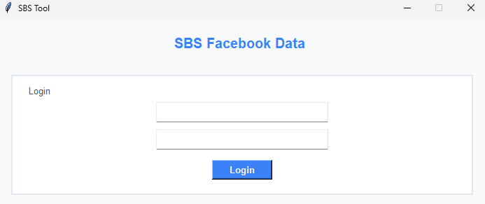

# Facebook-Tool-Extract-Posta
This APP for extract Posts from Groups in Facebook Posts
This document explains the code for a Facebook Scraping Tool built using Python, Selenium, Tkinter (for GUI), and Google Sheets API. The tool is designed to scrape posts from selected Facebook groups and save the extracted data to an Excel file.

## The tool allows the user to:

Log in to a Facebook account.
Select URLs for Facebook groups.
Scrape posts, including text, poster name, links, and images.
Save the data to an Excel file.
Log messages for progress and errors during the scraping process.

## Libraries and Modules Used

gspread: Interface with Google Sheets to fetch login credentials.
tkinter: GUI for user interaction.
selenium: Automates web browsing and scraping from Facebook.
webdriver_manager: Manages Chrome WebDriver installation.
pandas: Handles data manipulation and saves the scraped data to Excel.
os and time: File and timing operations.
re and urlparse: String manipulation and URL parsing.
datetime: Handles timestamp for scraping logs.

